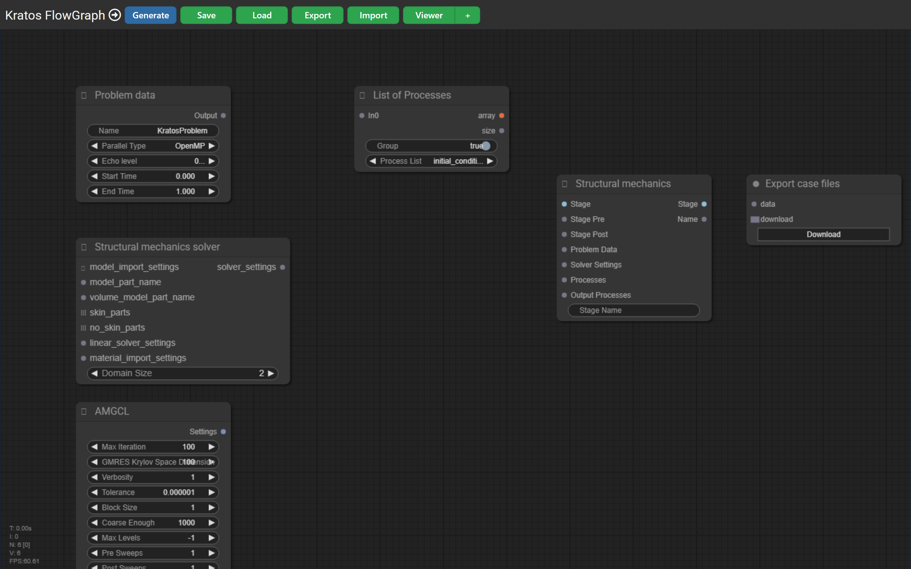

# Kratos FlowGraph

[](https://www.npmjs.com/package/kratos-flowgraph)
[](https://www.npmjs.com/package/kratos-flowgraph)
[](https://github.com/KratosMultiphysics/Flowgraph/actions/workflows/publish.yml)
[](https://github.com/KratosMultiphysics/Flowgraph/actions/workflows/docs.yml)
[](https://kratosmultiphysics.github.io/Flowgraph/)
[](LICENSE)
[](https://nodejs.org/)

**A visual node editor for configuring [KratosMultiphysics](https://github.com/KratosMultiphysics/Kratos) simulations.**

Instead of authoring a Kratos `ProjectParameters.json` by hand, you wire together nodes — analysis
stages, solvers, materials, processes, model parts and outputs — on a canvas, and FlowGraph
generates the JSON (and material files) for you.



## Quick start

Run the editor without installing anything:

```sh
npx kratos-flowgraph
```

Then open **<http://localhost:8182>** in your browser.

> 📖 **Full documentation:** <https://kratosmultiphysics.github.io/Flowgraph/>

## Features

- 🧩 **Visual, node-based configuration** — build a Kratos case by connecting nodes; the graph *is*
  the configuration.
- ⚙️ **Rich Kratos node library** (~85 node types) — analysis stages & orchestrators, fluid /
  structural / thermal / potential-flow solvers, serial & MPI linear solvers, constitutive laws
  (elastic, plasticity, damage), boundary-condition processes, modelers and output processes.
- 🔁 **Round-trip** — import an existing `ProjectParameters.json` and FlowGraph reconstructs the
  graph, or export the current graph as a zipped, ready-to-run case.
- 🖥️ **Live JSON viewer** — inspect the generated JSON as you build.
- 🚀 **No build step** — a small Node/Express server serves the editor; launch it with one command.

## Installation

### Run instantly (recommended)

```sh
npx kratos-flowgraph
```

### Global install

```sh
npm install -g kratos-flowgraph
kratos-flowgraph
```

### From source

```sh
git clone https://github.com/KratosMultiphysics/Flowgraph.git
cd Flowgraph
npm install
npm start        # node app.js
# or
npm run devstart # nodemon app.js (auto-reload)
```

Requires **Node.js 18+**.

## Configuration

Configuration lives in `config/default.json` (via the [`config`](https://www.npmjs.com/package/config)
package):

```json
{
    "host" : "127.0.0.1",
    "port" : "8182",
    "kratos_root": "/path/to/Kratos/bin/Release",
    "working_dir": "/path/to/working_dir",
    "python_binary": "python3"
}
```

Switch config files with `NODE_ENV`, e.g. `NODE_ENV=debug npm start` loads `config/debug.json`.

> The editor UI needs **no Kratos installation**. `kratos_root`, `working_dir` and `python_binary`
> are only used by the optional "run simulation" backend route.

## Documentation

The full documentation — installation, a getting-started walkthrough, the complete node reference,
and developer/architecture guides — is published with VitePress at:

**<https://kratosmultiphysics.github.io/Flowgraph/>**

The sources live in [`doc/`](doc/):

```sh
npm run docs:dev          # local docs dev server
npm run docs:build        # build the static docs
npm run docs:screenshots  # regenerate UI screenshots with Playwright
```

## Contributing

Contributions are welcome! When adding a feature or node, please keep the documentation in sync —
this is a project rule (see [CLAUDE.md](CLAUDE.md)):

> Whenever a new feature, node, or user-facing change is added, update **CLAUDE.md**, **README.md**
> and the **`doc/`** documentation in the same change (and regenerate screenshots if the UI
> changed). A feature is not complete until the docs reflect it.

Adding a node is easy: drop a `.js` file under `public/js/nodes/<category>/` that calls
`LiteGraph.registerNodeType(...)` — it is auto-discovered. See
[the developer guide](https://kratosmultiphysics.github.io/Flowgraph/development/adding-a-node).

## Publishing

Publishing to NPM is automated: bump `version` in `package.json` and create a **GitHub Release** —
the [`publish.yml`](.github/workflows/publish.yml) workflow publishes `kratos-flowgraph` using the
`NPM_TOKEN` secret. Docs deploy to GitHub Pages on every push to `master`.

## License

[AGPL-3.0-or-later](LICENSE).

<!-- ## Description 

### Tree of node dependencies

- Project Parameters: OK
  - Solver: OK
    - Assign materials to modelpart: WIP
      - Parse Modelpart WIP
      - Parse Materials WIP
    - Linear solver: OK
    - Time stepping WIP
    - Formulation: OK
  - List of processes: OK
    - … processes per application … : OK - WIP 
  - List of output processes: OK
    -  … processes per application … : OK - WIP


- Auxiliary modules
  - Export cases files
  - JSON Viewer

### Description of the nodes
#### Parse Materials:

 Lista de materiales. Que usar de nombres?
Assign materials to modelpart
Parse Modelpart file: MP settings
Parse materials file: Materials settings, lista de materiales

from MP settings creates list of materials as inputs.
Materials are connected to submp


#### Project parameters
*Required inputs*

solver
processes input
processes boundary conditions
processes output

*Optional inputs* (have sensitive defaults)
problem name
parallel type
echo level
start time
end time

*Output*: ProjectParameters object, that can be input for 
“Export case files”: need to pass data to get materials and model file.
“JSON Viewer”: actually, output is only json, so this is the only module available so far

WIP:
Project parameters module: reset input when connections change


#### Solvers
Solvers require data from other modules
“Parse modelparts file”, which returns Model parts settings (a json block with info about the model file name and type), and a list of submodelparts classified as volumetric, skin and non-skin
- Linear solvers
- Time stepping: Module that generate time stepping schemes
- Formulation: Module with options and setting for specific formulation of the solver
- Fluid Solver
*Required input*
Model part settings
Volume submodelpart
Skin submodelpart
Non-skin submodelparts
Linear solvers
Materials
Time stepping
Formulation

Structural Mechanics solver
*Time*
Time Stepping
    automatic_time_step: true / false
    time_step: 0.1
     "time_step_table": [
        [ 0.00, 0.01 ],
        [ 0.02, 0.01 ],
        [ 0.03, 0.10 ],
        [ 1.00, 0.10 ]
       ]
        }
WIP: Implement internal logic. Particularly, the time step table. Find a function that processes time in Kratos.
Formulation
Available formulations: fractional step, monolithic
Optional input:
element
orthogonal subscale
dynamic tau
Output:
Formulation object, to be connected to Solver module
Linear solvers
Setting for the AMGCL linear solver

*Optional parameters*
Coarsening:
Smoothing:
Krylov:
Processes
KratosMultiphysics
Fluid Dynamics Application
Structural Mechanics Application
Your Other Installed Application
Output
-->
